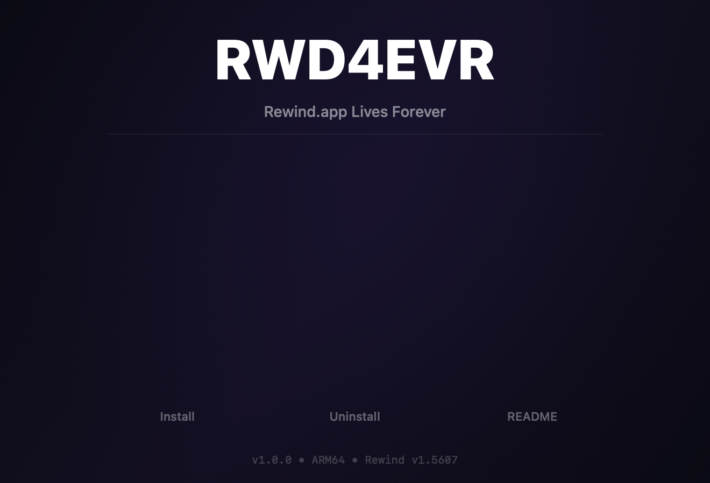

<p align="center">
  
</p>

<h1 align="center">RWD4EVR</h1>

<p align="center">
  <strong>Rewind.app Lives Forever</strong> — bypass the post-acquisition shutdown kill switch.
  <br><br>
  <a href="../../releases/latest"></a>
  <a href="LICENSE"></a>
  
  
</p>

---

Rewind.app was a macOS screen recording and memory search tool that ran entirely
on-device. After Meta acquired Limitless (formerly Rewind AI) in November 2025,
the application was shut down via a hardcoded cutoff date in the binary. Since
Rewind requires zero server contact to function — all recording, OCR,
transcription, and search happen locally — this patch disables the kill switch
and restores full functionality.

<p align="center">
  
</p>

## Quick Start

### From DMG (recommended)

1. Download `RWD4EVR.dmg` from [Releases](../../releases/latest)
2. Verify the checksum: `shasum -a 256 -c SHA256SUMS`
3. Open the DMG
4. Double-click **RWD4EVR Installer**
5. Follow the prompts

### From Source

```bash
git clone https://github.com/peguesj/rwd-forever.git
cd rwd-forever
make release
open dist/RWD4EVR.dmg
```

### CLI (advanced)

```bash
git clone https://github.com/peguesj/rwd-forever.git
cd rwd-forever
bash src/install.sh
```

## Requirements

- macOS 12.3 or later
- Apple Silicon (arm64)
- Rewind.app v1.5607 installed at `/Applications/Rewind.app`
- Xcode Command Line Tools (for building from source)

Intel Macs are not supported — the patch targets the arm64 slice only.

## How It Works

Rewind checks a hardcoded cutoff date at 19 locations throughout its recording
pipeline. All 19 checks call a single function that returns a boolean: `true` if
the current date is past the cutoff, `false` otherwise.

RWD4EVR patches that function (8 bytes) to immediately return `false`:

| | Original | Patched |
|---|---|---|
| Instruction 1 | `STP x26, x25, [sp, #-80]!` | `MOVZ w0, #0` |
| Instruction 2 | `STP x24, x31, [sp, #16]` | `RET` |
| Bytes | `fa 67 bb a9 f8 5f 01 a9` | `00 00 80 52 c0 03 5f d6` |
| Offset (fat binary) | `0x1533c7c` | `0x1533c7c` |
| Effect | Function prologue | Return false immediately |

After patching, the installer:
1. Re-signs the app with an ad-hoc code signature (preserving microphone and calendar entitlements)
2. Clears the "recording disabled" UI alert
3. Enables recording on launch
4. Disables Sparkle auto-update checks (the update server is dead)

## Uninstalling

Double-click **RWD4EVR Uninstaller** in the DMG, or:

```bash
bash src/uninstall.sh
```

The original binary is restored from the backup created during installation at
`~/Library/Application Support/RWD4EVR/backups/`.

## Verifying

Check the current state of your Rewind binary:

```bash
make verify
# or
bash src/verify.sh
```

## Project Structure

```
src/
  common.sh           Shared constants, offsets, and helper functions
  install.sh          Installer (CLI + GUI mode via --gui flag)
  uninstall.sh        Uninstaller (CLI + GUI mode)
  verify.sh           Patch verification and status report
packaging/
  build-apps.sh       Builds macOS .app bundles from src/ scripts
  build-dmg.sh        Creates the distributable DMG with custom layout
  gen-icon.swift      Generates app icons using Core Graphics
  gen-background.swift  Generates DMG background artwork
  gen-social.swift    Generates GitHub social preview image
assets/
  RWD4EVR.png         App icon (+ @0.5x through @4x variants)
  AppIcon.icns        macOS icon bundle (built from RWD4EVR.png)
  dmg-background.png  DMG window background
  social-preview.png  GitHub social preview (1280x640)
  entitlements.plist  Entitlements preserved during re-signing
INTEL.md              Reverse engineering analysis and notes
Makefile              Build system (make release)
```

## FAQ

**Will this break my existing recordings?**
No. Your recordings, database, and settings are not modified. Only the Rewind
executable binary is patched (8 bytes).

**Will macOS block the patched app?**
The original Developer ID signature is replaced with an ad-hoc signature, so
Apple notarization is lost. If Gatekeeper blocks the app:
```bash
xattr -cr /Applications/Rewind.app
```

**Can I update Rewind after patching?**
The auto-update server (`updates.rewind.ai`) is dead, so there are no updates
to install. The patch disables update checks to avoid unnecessary network
requests.

**Does this phone home?**
RWD4EVR itself makes zero network requests. The patched Rewind app will still
attempt to contact its analytics and Sentry endpoints, which fail gracefully
since those servers are also dead.

**What if I have an Intel Mac?**
Intel Macs are not supported. The patch targets the arm64 slice of the universal
binary. The x86_64 slice is left untouched.

## Acknowledgments

Rewind was a genuinely useful tool built by a talented team. This project exists
solely because the application's local-only functionality was artificially
disabled, not because of any deficiency in the original software.

## License

[MIT](LICENSE) — use at your own risk.

This project is not affiliated with Rewind AI, Limitless, or Meta. Rewind is a
trademark of its respective owner. Use of this software is your responsibility;
ensure compliance with applicable laws and agreements.
